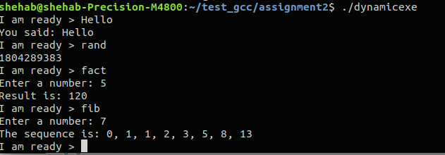

# Assignment2
## Commands:

### >> gcc fib.c -o fib.o -c
### >> gcc fact.c -o fact.o -c
### >> gcc rand.c -o rand.o -c
### >> gcc app.c -o app.o -c
### >> gcc *c -o dynamicexe -lc
### >> gcc *c -o staticexe -lc --static

